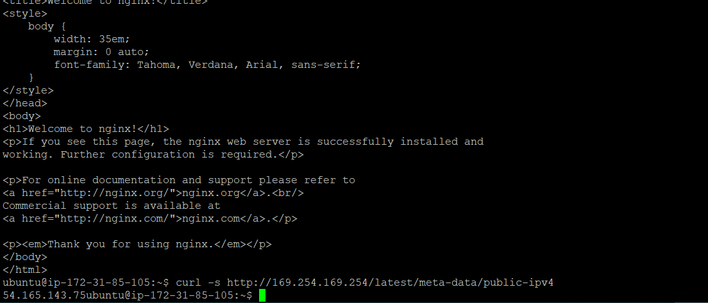
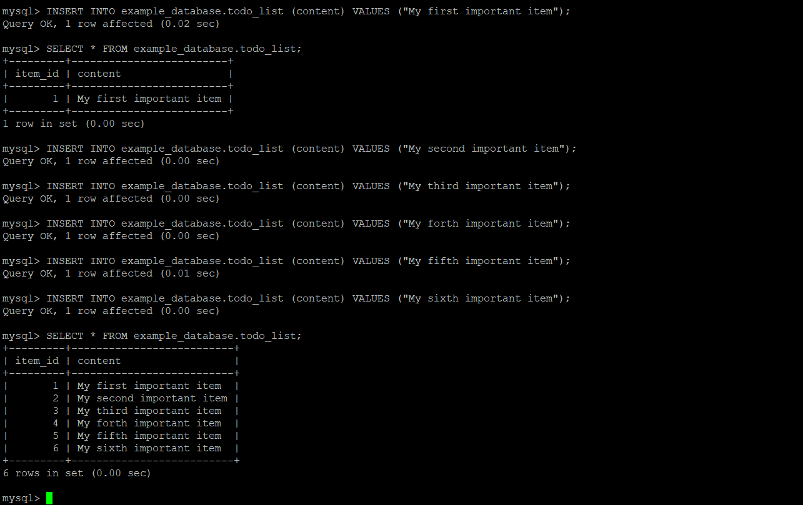

## WEB STACK IMPLEMENTATION (LEMP STACK)

### Deploy web solution using LEMP (Linux NGINX MYSQL PHP) stack

### Deployed an EC2 instance of t2.micro family of Ubuntu server 20.04LTS. Accessed the server via ssh remotely.

#

*STEP 1: Updated the server via below command. type 'Y' when prompted*

`sudo apt update`


*STEP 2: Installed Nginx using the command below. Type 'y' when prompted*

`sudo apt install nginx`


*STEP 3: Check the status of ngix web server to ensure it is running after installation. **Also modify security group attached to EC2 to all inbound traffic on port 80 (http)***

`sudo systemctl status nginx`


*STEP 4: Confirm that nginx server is accessible locally and via a web brower*

`curl http://localhost:80`

`curl http://127.0.0.1:80`


*Reachable via the web browser while using the public IP gotten from EC2 Instance*


`curl -s http://<public-IP>/latest/meta-data/public-ipv4`



*STEP 5: Now install database managment system so we can store and manage data for the site in a relational database. Type 'y' when prompted*

`sudo apt install mysql-server`


*STEP 6: Log in to mysql console with below command after installation completes. This should connect as server administrative database user **root**. Ran the required security script which comes preinstalled with MYSQL. This will remove some insecure default settings and lock down access to the database system. Prior running the script, a password need to be set for **root** user, using mysql_native_password as default authentication method. Then exit mysql*

`sudo mysql`

`ALTER USER 'root'@'localhost' IDENTIFIED WITH mysql_native_password BY 'password1';`

`exit`


*STEP 7: Started interative script to secure mysql installation. This will ask if you want to configure the VALIDATE PASSWORD PLUGIN. **Note:** if enabled, password which dont match the specified criteria will be rejected by MYSQLwith an error. This helps to improve security. It is optional but recommended while also considering it security benefits *

`sudo mysql secure installation`


*Testing access to mysql database server after securing installation and also exiting mysql with below command*

`sudo mysql -p`

`exit`


### Installating php

*STEP 8: Installing PHP (Type 'y' and hit enter when prompted alternatively -y can be added to the installation command). Nginx requires an external program to handle PHP processing and act like a bridge between php interpreter itself and the web server*

`sudo apt install php-fpm php-mysql`


### Configuring Nginx to Use PHP Processor
#### When using the Nginx web server, we can create server blocks (similar to virtual hosts in Apache) to encapsulate configuration details and host more than one domain on a single server. In this guide, we will use projectLEMP as an example domain name.
#### On Ubuntu 20.04, Nginx has one server block enabled by default and is configured to serve documents out of a directory at /var/www/html. While this works well for a single site, it can become difficult to manage if you are hosting multiple sites. Instead of modifying /var/www/html, created a directory structure within /var/www for the my_domain website, leaving /var/www/html in place as the default directory to be served if a client request does not match any other sites.

*Create the root web directory for projectLEMP*

`sudo mkdir /var/www/projectLEMP`

*Assign ownership of the directory with the $USER environment variable, which will reference your current system user*

`sudo chown -R $USER:$USER /var/www/projectLEMP`

*Using nano in this case, open a new configuration file in Nginx’s sites-available directory. Use your preferred command-line editor. This will create a new blank file. Paste in the following bare-bones configuration:

```server {
    listen 80;
    server_name projectLEMP www.projectLEMP;
    root /var/www/projectLEMP;
index index.html index.htm index.php;
location / {
        try_files $uri $uri/ =404;
    }
location ~ \.php$ {
        include snippets/fastcgi-php.conf;
        fastcgi_pass unix:/var/run/php/php8.1-fpm.sock;
     }
location ~ /\.ht {
        deny all;
    }
}
```
#/etc/nginx/sites-available/projectLEMP*

`sudo nano /etc/nginx/sites-available/projectLEMP`

*Activate configuration by linking to the config file from Nginx’s sites-enabled directory using below command. This will tell Nginx to use the configuration next time it is reloaded*

`sudo ln -s /etc/nginx/sites-available/projectLEMP /etc/nginx/sites-enabled/`

*Test your configuration for syntax errors using <mark>sudo nginx -t</mark> command. You shall see following message:

nginx: the configuration file /etc/nginx/nginx.conf syntax is ok

nginx: configuration file /etc/nginx/nginx.conf test is successful

If any errors are reported, go back to your configuration file to review its contents before continuing*

`sudo nginx -t`

*Disable default Nginx host that is currently configured to listen on port 80*

`sudo unlink /etc/nginx/sites-enabled/default`

*Reload Nginx to apply the changes*

`sudo systemctl reload nginx`

*The new website is now active, but the web root /var/www/projectLEMP is still empty. Created an index.html file in that location so that we can test that your new server block works as expected:*

`sudo echo 'Hello LEMP from hostname' $(curl -s http://169.254.169.254/latest/meta-data/public-hostname) 'with public IP' $(curl -s http://169.254.169.254/latest/meta-data/public-ipv4) > /var/www/projectLEMP/index.html`

*Test via browser and if Hello LEMP from hostname appears, thats good. You can leave this file in place as a temporary landing page for your application until you set up an index.php file to replace it. Once you do that, remember to remove or rename the index.html file from your document root, as it would take precedence over an index.php file by default.
Your LEMP stack is now fully configured. In the next step, we’ll create a PHP script to test that Nginx is in fact able to handle .php files within your newly configured website.*

*To confirm LAMP stack is setup, we can validate that Nginx can correctly hand .php files off to your PHP processor.
This can be done by creating a test PHP file in your document root. Open a new file called info.php within your document root in text editor*

`sudo nano /var/www/projectLEMP/info.php`


*Type the following lines into the new file. This is valid PHP code that returns information about your server*

```
<?php
phpinfo();
```
*Access this page in your web browser by visiting the domain name or public IP address you’ve set up in your Nginx configuration file, followed by /info.php. You will see a web page containing detailed information about your server*

*Reload ngnix*

`sudo systemctl reload nginx`


`http://<server_domain_or_IP>/info.php`


*It’s best to remove the file you created as it contains sensitive information about your PHP environment and your Ubuntu server. You can use rm to remove that file:*

`sudo rm /var/www/your_domain/info.php`

*Create a test database (DB) with simple "To do list" and configure access to it, so the Nginx website would be able to query data from the DB and display it.*

`sudo mysql -p`

```CREATE DATABASE `example_database`;```


*Create a new user and grant him full privileges on the database you have just created.
The following command creates a new user named example_user, using mysql_native_password as default authentication method. We’re defining this user’s password as password, but you should replace this value with a secure password of your own choosing.*

`CREATE USER 'example_user'@'%' IDENTIFIED WITH mysql_native_password BY 'password';`

*Give this user permission over the example_database database. This will give the example_user user full privileges over the example_database database, while preventing this user from creating or modifying other databases on the server.*

`GRANT ALL ON example_database.* TO 'example_user'@'%';`

*Exit the MySQL shell*

`exit`

*Test if the new user has the proper permissions by logging in to the MySQL console again, this time using the custom user credentials*

`mysql -u example_user -p`

*After logging in to the MySQL console, confirm that you have access to the example_database database*


`SHOW DATABASES;`

*Create a test table named todo_list. From the MySQL console*

```
CREATE TABLE example_database.todo_list (item_id INT AUTO_INCREMENT, content VARCHAR(255), PRIMARY KEY(item_id));
```
*Insert a few rows of content in the test table. You might want to repeat the next command a few times, using different VALUES*

`INSERT INTO example_database.todo_list (content) VALUES ("My first important item");`




*To confirm that the data was successfully saved to your table, run:*

`SELECT * FROM example_database.todo_list;`

*exit the MySQL console*

`exit`


*Create a new PHP file in your custom web root directory using your preferred editor. The following PHP script connects to the MySQL database and queries for the content of the todo_list table, displays the results in a list. If there is a problem with the database connection, it will throw an exception.
Copy this content into your todo_list.php script*

```
<?php
$user = "example_user";
$password = "password";
$database = "example_database";
$table = "todo_list";
try {
  $db = new PDO("mysql:host=localhost;dbname=$database", $user, $password);
  echo "<h2>TODO</h2><ol>";
  foreach($db->query("SELECT content FROM $table") as $row) {
    echo "<li>" . $row['content'] . "</li>";
  }
  echo "</ol>";
} catch (PDOException $e) {
    print "Error!: " . $e->getMessage() . "<br/>";
    die();
}
```

`nano /var/www/projectLEMP/todo_list.php`

*Access this page in your web browser by visiting the domain name or public IP address configured for your website, followed by /todo_list.php*

`http://<Public_domain_or_IP>/todo_list.php`

